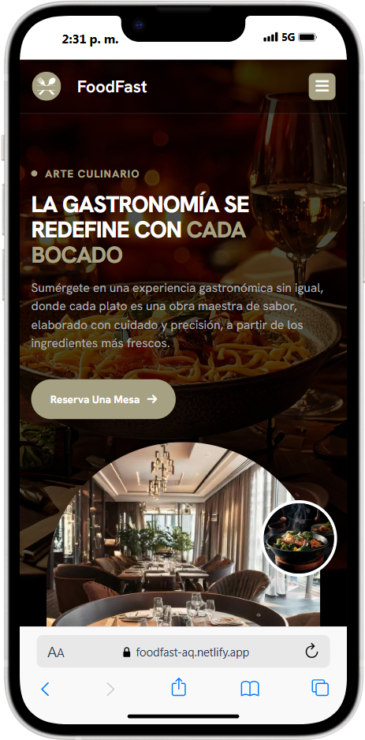
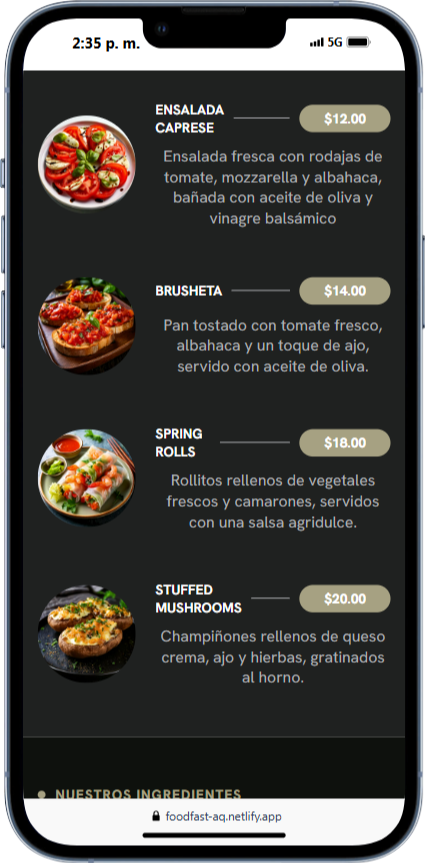

# 🌟 FoodFast - Plantilla Estática para Restaurantes 🍽️

📢 **Bienvenido/a a Comidita Comedor**, una plantilla web estática para restaurantes creada con **HTML, CSS y JavaScript puro**. Este proyecto forma parte de un **tutorial de YouTube**, donde aprenderás a construir una página web moderna con diseño responsivo.

  
   
   
   
  
  
  

## 🚀 **Características**

✔️ Diseño responsivo y adaptable para dispositivos móviles
✔️ Animaciones suaves con CSS  
✔️ Menú de navegación interactivo  
✔️ Secciones personalizables (Inicio, Menú, Reservaciones, Contacto)  
✔️ FAQ interactivo con JavaScript

---

🛠 Tecnologías Utilizadas

- HTML5
- CSS3 Moderno (Flexbox y Grid, Anidamiento, Variables)
- JavaScript
- FontAwesome
- Google Fonts
